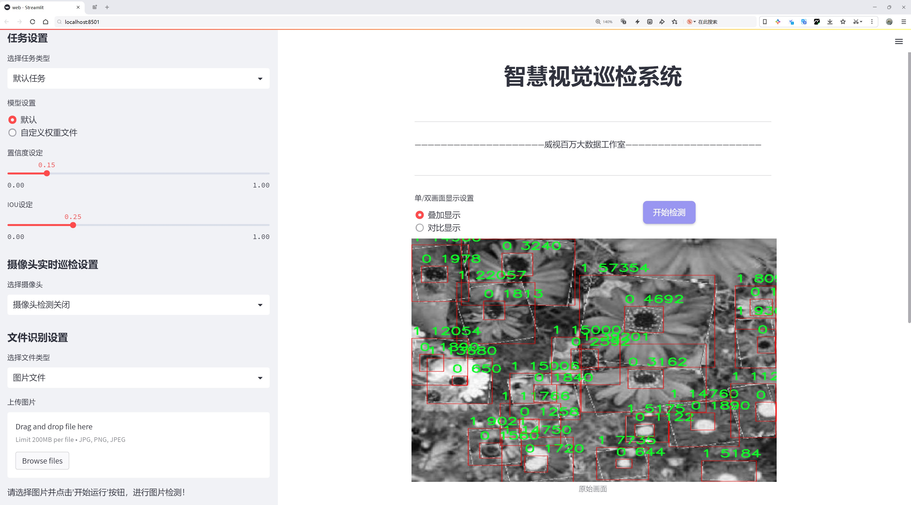
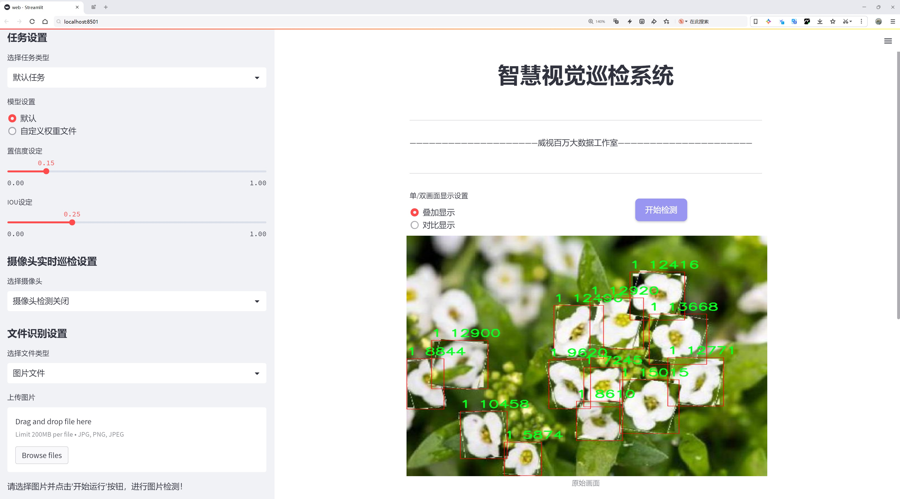
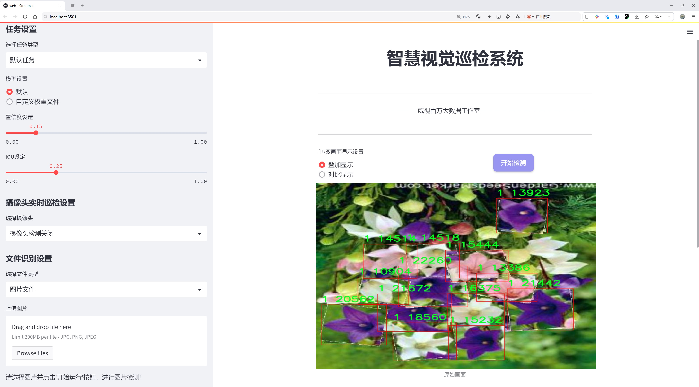
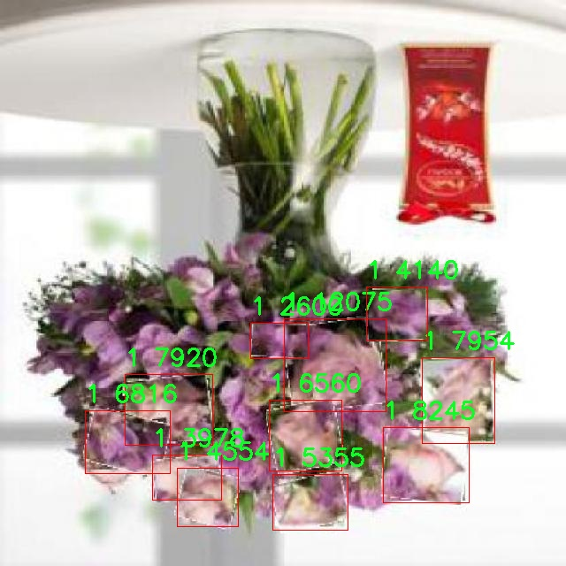
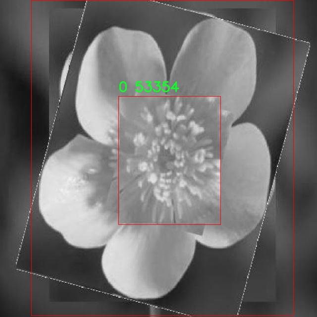
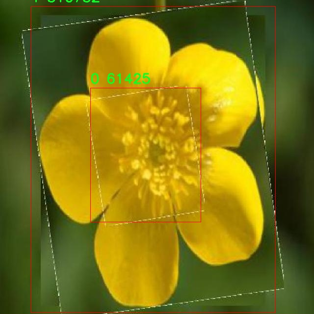
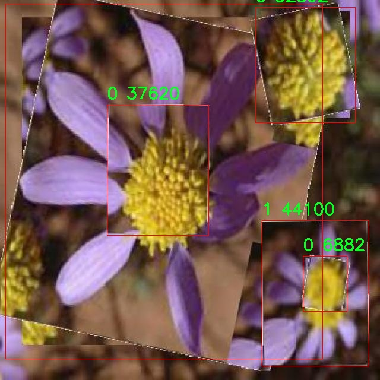
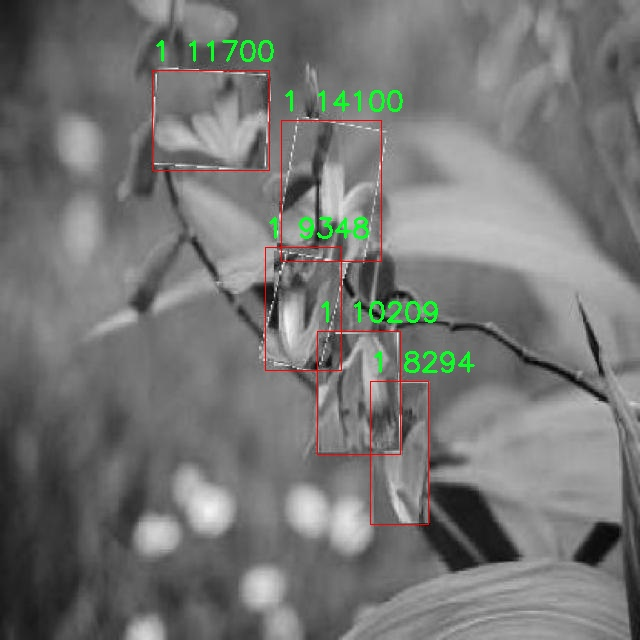

# 花卉识别检测系统源码分享
 # [一条龙教学YOLOV8标注好的数据集一键训练_70+全套改进创新点发刊_Web前端展示]

### 1.研究背景与意义

项目参考[AAAI Association for the Advancement of Artificial Intelligence](https://gitee.com/qunmasj/projects)

项目来源[AACV Association for the Advancement of Computer Vision](https://kdocs.cn/l/cszuIiCKVNis)

研究背景与意义

随着人工智能技术的迅猛发展，计算机视觉在各个领域的应用日益广泛，尤其是在物体检测和图像识别方面。花卉作为自然界中美丽而多样的生物，其识别与分类不仅在生态研究、农业生产中具有重要意义，也在园艺、旅游、教育等领域展现出广泛的应用潜力。传统的花卉识别方法多依赖于人工观察和经验，效率低下且易受主观因素影响。随着深度学习技术的兴起，基于卷积神经网络（CNN）的图像识别方法逐渐成为主流，其中YOLO（You Only Look Once）系列模型因其高效的实时检测能力而备受关注。

本研究旨在基于改进的YOLOv8模型，构建一个高效的花卉识别系统。该系统的核心在于利用YOLOv8的优势，结合针对特定花卉种类的优化策略，以提高识别精度和速度。数据集方面，本研究使用了包含2300张图像的花卉数据集，涵盖了两类花卉，分别标记为0和1。这一数据集为模型的训练和测试提供了基础，同时也为后续的应用场景奠定了数据支持。

在实际应用中，花卉识别系统可以广泛应用于农业监测、植物保护、园艺设计等领域。例如，在农业监测中，系统能够实时识别作物生长情况，及时发现病虫害，为农民提供科学的管理建议；在园艺设计中，系统可以帮助设计师快速识别和选择合适的花卉品种，提升设计效率。此外，花卉识别系统还可以为教育机构提供生物学和生态学的教学辅助工具，增强学生对植物多样性的认识。

本研究的意义不仅在于技术层面的创新，更在于推动花卉识别领域的应用落地。通过改进YOLOv8模型，我们期望能够在保持高识别率的同时，提升系统的实时性和适应性，满足不同场景下的需求。此外，研究成果将为后续的花卉种类扩展和新特征的引入提供理论基础和实践经验，为相关领域的研究者和从业者提供参考。

综上所述，基于改进YOLOv8的花卉识别系统的研究，不仅具有重要的学术价值，也将为实际应用带来深远的影响。通过高效、准确的花卉识别技术，我们可以更好地理解和保护自然生态，推动可持续发展目标的实现。

### 2.图片演示







##### 注意：由于此博客编辑较早，上面“2.图片演示”和“3.视频演示”展示的系统图片或者视频可能为老版本，新版本在老版本的基础上升级如下：（实际效果以升级的新版本为准）

  （1）适配了YOLOV8的“目标检测”模型和“实例分割”模型，通过加载相应的权重（.pt）文件即可自适应加载模型。

  （2）支持“图片识别”、“视频识别”、“摄像头实时识别”三种识别模式。

  （3）支持“图片识别”、“视频识别”、“摄像头实时识别”三种识别结果保存导出，解决手动导出（容易卡顿出现爆内存）存在的问题，识别完自动保存结果并导出到tempDir中。

  （4）支持Web前端系统中的标题、背景图等自定义修改，后面提供修改教程。

  另外本项目提供训练的数据集和训练教程,暂不提供权重文件（best.pt）,需要您按照教程进行训练后实现图片演示和Web前端界面演示的效果。

### 3.视频演示

[3.1 视频演示](https://www.bilibili.com/video/BV1nKsZeHES1/)

### 4.数据集信息展示

##### 4.1 本项目数据集详细数据（类别数＆类别名）

nc: 2
names: ['0', '1']


##### 4.2 本项目数据集信息介绍

数据集信息展示

在本研究中，我们使用了名为“20221119”的数据集，以改进YOLOv8的花卉识别系统。该数据集的设计旨在提供一个高效且精准的基础，以支持深度学习模型在花卉识别任务中的训练和评估。数据集的类别数量为2，分别标记为‘0’和‘1’，这两个类别可能代表不同类型的花卉或花卉的不同状态，具体的类别定义将在后续的研究中进一步明确。

“20221119”数据集的构建过程经过精心设计，确保了数据的多样性和代表性。数据集中的图像均经过严格筛选，确保其质量和清晰度，以便于YOLOv8模型能够有效地学习和提取特征。每个类别的样本数量均衡，旨在避免模型在训练过程中出现偏倚，从而提高其在实际应用中的泛化能力。

数据集中的图像涵盖了不同的拍摄角度、光照条件和背景环境，这些因素都是影响花卉识别准确率的重要变量。通过这种多样化的图像采集方式，我们希望能够增强模型的鲁棒性，使其在面对不同环境和条件时仍能保持较高的识别精度。此外，数据集中还包含了一些带有遮挡和模糊的图像，以模拟真实世界中可能遇到的复杂情况，进一步提升模型的适应能力。

在数据标注方面，所有图像均由专业人员进行标注，确保每个类别的准确性和一致性。标注过程中采用了严格的质量控制流程，以减少人为错误对模型训练的影响。每个图像的标注信息都被记录在数据集中，便于后续的训练和评估过程。

为了提高数据集的可用性和便捷性，我们还对图像进行了预处理，包括尺寸调整、归一化和数据增强等操作。这些预处理步骤不仅有助于提高模型的训练效率，还能有效地防止过拟合现象的发生。数据增强技术的应用，如随机裁剪、旋转和颜色变换等，进一步丰富了训练样本的多样性，使得模型能够在训练过程中接触到更多的变异情况。

总之，“20221119”数据集为改进YOLOv8的花卉识别系统提供了坚实的基础。通过精心的设计和严格的标注流程，该数据集不仅涵盖了丰富的样本和多样的场景，还确保了数据的高质量和高准确性。我们相信，利用这一数据集进行训练的YOLOv8模型将在花卉识别任务中展现出优异的性能，为相关领域的研究和应用提供有力支持。随着研究的深入，我们期待能够通过不断优化模型和数据集，推动花卉识别技术的发展，为生态保护、农业管理等领域带来积极的影响。











### 5.全套项目环境部署视频教程（零基础手把手教学）

[5.1 环境部署教程链接（零基础手把手教学）](https://www.ixigua.com/7404473917358506534?logTag=c807d0cbc21c0ef59de5)


[5.2 安装Python虚拟环境创建和依赖库安装视频教程链接（零基础手把手教学）](https://www.ixigua.com/7404474678003106304?logTag=1f1041108cd1f708b01a)

### 6.手把手YOLOV8训练视频教程（零基础小白有手就能学会）

[6.1 手把手YOLOV8训练视频教程（零基础小白有手就能学会）](https://www.ixigua.com/7404477157818401292?logTag=d31a2dfd1983c9668658)

### 7.70+种全套YOLOV8创新点代码加载调参视频教程（一键加载写好的改进模型的配置文件）

[7.1 70+种全套YOLOV8创新点代码加载调参视频教程（一键加载写好的改进模型的配置文件）](https://www.ixigua.com/7404478314661806627?logTag=29066f8288e3f4eea3a4)

### 8.70+种全套YOLOV8创新点原理讲解（非科班也可以轻松写刊发刊，V10版本正在科研待更新）

由于篇幅限制，每个创新点的具体原理讲解就不一一展开，具体见下列网址中的创新点对应子项目的技术原理博客网址【Blog】：


[8.1 70+种全套YOLOV8创新点原理讲解链接](https://gitee.com/qunmasj/good)

### 9.系统功能展示（检测对象为举例，实际内容以本项目数据集为准）

图9.1.系统支持检测结果表格显示

  图9.2.系统支持置信度和IOU阈值手动调节

  图9.3.系统支持自定义加载权重文件best.pt(需要你通过步骤5中训练获得)

  图9.4.系统支持摄像头实时识别

  图9.5.系统支持图片识别

  图9.6.系统支持视频识别

  图9.7.系统支持识别结果文件自动保存

  图9.8.系统支持Excel导出检测结果数据


### 10.原始YOLOV8算法原理

原始YOLOv8算法原理

YOLOv8算法作为YOLO系列的最新版本，代表了目标检测领域的一次重要进步，其设计理念与实现方式在多个方面进行了创新与优化。首先，YOLOv8在骨干网络的构建上依然延续了跨级结构（Cross Stage Partial, CSP）的思想，但对YOLOv5中的C3模块进行了显著的改进，采用了更为轻量化的C2f结构。这一变化不仅提升了模型的计算效率，还增强了特征表示能力，使得网络在处理复杂场景时能够更好地捕捉到细节信息。

在特征提取方面，YOLOv8保留了空间金字塔池化（SPPF）模块，这一模块通过不同尺度的池化操作，能够有效地融合多层次的特征信息，提升了模型对不同尺寸目标的检测能力。同时，YOLOv8在颈部网络的设计上，采用了路径聚合网络（PAN）结构，这一结构通过加强不同尺度特征的融合，进一步提升了网络对目标的定位精度和语义理解能力。通过这种设计，YOLOv8能够在处理多尺度目标时，保持高效的特征传递与融合，确保了检测结果的准确性。

在目标检测的头部网络部分，YOLOv8引入了新的损失计算策略。相较于传统的损失函数，YOLOv8采用了变焦损失（Focal Loss）来计算分类损失，同时结合数据平均保真度损失和完美交并比损失（CIOU Loss）来优化边界框的预测。这种新的损失策略使得模型在面对类别不平衡和边界框回归时，能够更加精准地进行调整，显著提升了检测的精度与鲁棒性。

此外，YOLOv8在样本匹配方式上也进行了创新，采用了Task-Aligned Assigner策略，该策略通过对分类与回归分数的加权，智能地选择正样本。这一改进使得模型在训练过程中能够更有效地学习到目标的特征，从而提升了整体的检测性能。

YOLOv8的网络结构被划分为四个主要部分：输入端、骨干网络、颈部网络和头部网络。输入端负责对图像进行预处理，包括马赛克数据增强、自适应锚框计算和自适应灰度填充等操作，这些步骤为后续的特征提取奠定了基础。骨干网络则通过C2f模块和SPPF模块的结合，形成了一个强大的特征提取器，能够有效捕捉图像中的重要信息。

在颈部网络中，YOLOv8通过特征金字塔与路径聚合网络的结合，增强了对不同尺度目标的特征融合能力。这一设计不仅提高了网络对小目标的检测能力，也使得模型在复杂背景下的表现更加稳健。头部网络则将分类与检测过程解耦，采用了主流的解耦头结构，进一步提升了模型的检测效率和准确性。

值得一提的是，YOLOv8在实现上也考虑到了模型的轻量化与实时性，提供了多种不同规模的模型版本（如YOLOv8n、YOLOv8s、YOLOv8m、YOLOv8l、YOLOv8x），用户可以根据具体的应用场景选择合适的模型。这种灵活性使得YOLOv8能够广泛应用于各类实时目标检测任务中，如自动驾驶、视频监控、智能安防等领域。

总的来说，YOLOv8算法通过一系列创新与优化，提升了目标检测的精度与速度，充分展现了YOLO系列算法在深度学习领域的前沿地位。其独特的网络结构设计、先进的损失计算策略以及灵活的模型选择，使得YOLOv8不仅在学术研究中具有重要意义，也在实际应用中展现出广泛的适用性和优越性。随着技术的不断进步，YOLOv8无疑将为目标检测领域带来更多的可能性与发展机遇。


### 11.项目核心源码讲解（再也不用担心看不懂代码逻辑）

#### 11.1 ui.py

以下是代码的核心部分，并附上详细的中文注释：

```python
import sys
import subprocess

def run_script(script_path):
    """
    使用当前 Python 环境运行指定的脚本。

    Args:
        script_path (str): 要运行的脚本路径

    Returns:
        None
    """
    # 获取当前 Python 解释器的路径
    python_path = sys.executable

    # 构建运行命令，使用 streamlit 运行指定的脚本
    command = f'"{python_path}" -m streamlit run "{script_path}"'

    # 执行命令，并等待其完成
    result = subprocess.run(command, shell=True)
    
    # 检查命令执行的返回码，如果不为0则表示出错
    if result.returncode != 0:
        print("脚本运行出错。")

# 主程序入口
if __name__ == "__main__":
    # 指定要运行的脚本路径
    script_path = "web.py"  # 这里可以替换为实际的脚本路径

    # 调用函数运行指定的脚本
    run_script(script_path)
```

### 代码分析：
1. **导入模块**：
   - `sys`：用于访问与 Python 解释器相关的变量和函数。
   - `subprocess`：用于创建新进程、连接到它们的输入/输出/错误管道，并获得返回码。

2. **`run_script` 函数**：
   - 该函数接收一个脚本路径作为参数，并使用当前 Python 环境运行该脚本。
   - `sys.executable` 获取当前 Python 解释器的路径，以确保使用正确的 Python 版本。
   - 使用 `subprocess.run` 执行构建的命令，并通过 `shell=True` 允许在 shell 中执行命令。
   - 检查返回码，如果不为0，表示脚本运行出错，打印错误信息。

3. **主程序入口**：
   - 使用 `if __name__ == "__main__":` 确保该代码块仅在直接运行脚本时执行，而不是在被导入时执行。
   - 指定要运行的脚本路径（在这里是 `web.py`），并调用 `run_script` 函数来执行该脚本。 

### 注意事项：
- 在实际使用中，可以根据需要修改 `script_path` 变量以指向不同的脚本文件。
- 确保 `streamlit` 已安装并可在当前 Python 环境中使用。

这个程序文件 `ui.py` 的主要功能是运行一个指定的 Python 脚本，具体来说是通过 Streamlit 框架来启动一个 Web 应用。程序的结构相对简单，主要由几个部分组成。

首先，文件导入了一些必要的模块，包括 `sys`、`os` 和 `subprocess`。其中，`sys` 模块用于访问与 Python 解释器相关的变量和函数，`os` 模块提供了与操作系统交互的功能，而 `subprocess` 模块则用于执行外部命令。

接下来，文件中定义了一个名为 `run_script` 的函数，该函数接受一个参数 `script_path`，表示要运行的脚本的路径。在函数内部，首先获取当前 Python 解释器的路径，使用 `sys.executable` 来实现。然后，构建一个命令字符串，该命令用于调用 Streamlit 来运行指定的脚本。命令的格式是 `"{python_path}" -m streamlit run "{script_path}"`，其中 `{python_path}` 和 `{script_path}` 会被实际的路径替换。

接着，使用 `subprocess.run` 方法来执行构建好的命令。如果命令执行的返回码不为 0，表示脚本运行过程中出现了错误，程序会打印出“脚本运行出错。”的提示信息。

最后，在文件的主程序部分，使用 `if __name__ == "__main__":` 来确保只有在直接运行该文件时才会执行以下代码。这里指定了要运行的脚本路径，调用了 `abs_path` 函数来获取 `web.py` 的绝对路径。然后，调用 `run_script` 函数来启动这个脚本。

总体来说，这个程序的功能是启动一个 Streamlit Web 应用，提供了一种简单的方式来运行 Python 脚本，适合用于开发和测试 Web 应用。

#### 11.2 70+种YOLOv8算法改进源码大全和调试加载训练教程（非必要）\ultralytics\nn\extra_modules\ops_dcnv3\setup.py

以下是经过简化和注释的核心代码部分：

```python
# 导入必要的库
import os
import glob
import torch
from torch.utils.cpp_extension import CUDA_HOME, CppExtension, CUDAExtension
from setuptools import find_packages, setup

# 定义所需的Python库
requirements = ["torch", "torchvision"]

def get_extensions():
    # 获取当前文件目录
    this_dir = os.path.dirname(os.path.abspath(__file__))
    # 定义扩展源代码目录
    extensions_dir = os.path.join(this_dir, "src")

    # 获取主文件和CPU、CUDA源文件
    main_file = glob.glob(os.path.join(extensions_dir, "*.cpp"))
    source_cpu = glob.glob(os.path.join(extensions_dir, "cpu", "*.cpp"))
    source_cuda = glob.glob(os.path.join(extensions_dir, "cuda", "*.cu"))

    # 将主文件和CPU源文件合并
    sources = main_file + source_cpu
    extension = CppExtension  # 默认使用CppExtension
    extra_compile_args = {"cxx": []}  # 编译参数
    define_macros = []  # 宏定义

    # 检查CUDA是否可用
    if torch.cuda.is_available() and CUDA_HOME is not None:
        extension = CUDAExtension  # 使用CUDA扩展
        sources += source_cuda  # 添加CUDA源文件
        define_macros += [("WITH_CUDA", None)]  # 定义CUDA宏
        extra_compile_args["nvcc"] = []  # CUDA编译参数
    else:
        raise NotImplementedError('Cuda is not available')  # 抛出异常

    # 将源文件路径转换为绝对路径
    sources = [os.path.join(extensions_dir, s) for s in sources]
    include_dirs = [extensions_dir]  # 包含目录

    # 创建扩展模块
    ext_modules = [
        extension(
            "DCNv3",  # 模块名称
            sources,  # 源文件列表
            include_dirs=include_dirs,  # 包含目录
            define_macros=define_macros,  # 宏定义
            extra_compile_args=extra_compile_args,  # 编译参数
        )
    ]
    return ext_modules  # 返回扩展模块列表

# 设置包信息和扩展模块
setup(
    name="DCNv3",  # 包名称
    version="1.1",  # 版本号
    author="InternImage",  # 作者
    url="https://github.com/OpenGVLab/InternImage",  # 项目链接
    description="PyTorch Wrapper for CUDA Functions of DCNv3",  # 描述
    packages=find_packages(exclude=("configs", "tests")),  # 查找包
    ext_modules=get_extensions(),  # 获取扩展模块
    cmdclass={"build_ext": torch.utils.cpp_extension.BuildExtension},  # 构建扩展的命令类
)
```

### 代码说明：
1. **导入库**：导入了处理文件路径、CUDA扩展和包管理的必要库。
2. **获取扩展函数**：定义了一个函数`get_extensions()`，用于获取需要编译的C++和CUDA源文件，并返回一个扩展模块列表。
3. **CUDA检查**：在获取源文件后，检查CUDA是否可用，并根据情况选择合适的扩展类型（`CppExtension`或`CUDAExtension`）。
4. **设置包信息**：使用`setuptools`的`setup()`函数来定义包的基本信息，包括名称、版本、作者、描述等，并指定扩展模块。

这个 `setup.py` 文件是用于构建和安装一个名为 `DCNv3` 的 Python 包，该包是一个用于 PyTorch 的 CUDA 函数的封装。文件开头包含了一些版权信息和许可证声明，接下来是必要的库导入，包括操作系统模块、文件路径处理模块、PyTorch 相关模块以及 setuptools 库。

在 `requirements` 列表中，指定了该包依赖的库，包括 `torch` 和 `torchvision`。接下来的 `get_extensions` 函数用于查找和准备要编译的 C++ 和 CUDA 源文件。首先，它获取当前文件的目录，并构建源文件的路径。然后，它使用 `glob` 模块查找 `src` 目录下的所有 C++ 和 CUDA 文件。

根据系统是否支持 CUDA，代码会选择不同的扩展类型。如果 CUDA 可用，则使用 `CUDAExtension`，并将 CUDA 源文件添加到编译源列表中，同时定义了一个宏 `WITH_CUDA`。如果 CUDA 不可用，则抛出一个 `NotImplementedError`，提示用户 CUDA 不可用。

在准备好所有源文件后，代码将这些文件的路径整理到一个列表中，并设置包含目录。接着，创建一个扩展模块 `ext_modules`，该模块使用 `CppExtension` 或 `CUDAExtension` 进行定义，包含了模块名称、源文件、包含目录、宏定义和编译参数。

最后，调用 `setup` 函数来配置包的元数据和扩展模块。该函数指定了包的名称、版本、作者、项目网址、描述信息、要包含的包以及扩展模块。`cmdclass` 参数用于指定自定义的构建扩展命令，这里使用了 PyTorch 提供的 `BuildExtension`。

总的来说，这个 `setup.py` 文件的主要功能是为 `DCNv3` 包配置编译和安装过程，确保能够正确地处理 C++ 和 CUDA 代码，以便在 PyTorch 中使用。

#### 11.3 code\ui.py

```python
import sys
import subprocess

def run_script(script_path):
    """
    使用当前 Python 环境运行指定的脚本。

    Args:
        script_path (str): 要运行的脚本路径

    Returns:
        None
    """
    # 获取当前 Python 解释器的路径
    python_path = sys.executable

    # 构建运行命令
    command = f'"{python_path}" -m streamlit run "{script_path}"'

    # 执行命令
    result = subprocess.run(command, shell=True)
    if result.returncode != 0:
        print("脚本运行出错。")


# 实例化并运行应用
if __name__ == "__main__":
    # 指定您的脚本路径
    script_path = "web.py"  # 这里直接指定脚本路径

    # 运行脚本
    run_script(script_path)
```

### 代码详细注释：

1. **导入模块**：
   - `import sys`：导入 sys 模块，用于访问与 Python 解释器紧密相关的变量和函数。
   - `import subprocess`：导入 subprocess 模块，用于创建新进程、连接到它们的输入/输出/错误管道，并获取它们的返回码。

2. **定义函数 `run_script`**：
   - 该函数接受一个参数 `script_path`，表示要运行的 Python 脚本的路径。

3. **获取当前 Python 解释器的路径**：
   - `python_path = sys.executable`：通过 `sys.executable` 获取当前 Python 解释器的完整路径。

4. **构建运行命令**：
   - `command = f'"{python_path}" -m streamlit run "{script_path}"'`：使用 f-string 格式化字符串，构建一个命令，用于通过当前 Python 解释器运行指定的脚本。这里使用了 `streamlit` 模块来运行 web 应用。

5. **执行命令**：
   - `result = subprocess.run(command, shell=True)`：使用 `subprocess.run` 方法执行构建的命令。`shell=True` 允许在 shell 中执行命令。

6. **检查命令执行结果**：
   - `if result.returncode != 0:`：检查命令的返回码，如果不为 0，表示脚本运行出错。
   - `print("脚本运行出错。")`：输出错误信息。

7. **主程序入口**：
   - `if __name__ == "__main__":`：确保该代码块仅在直接运行该脚本时执行，而不是作为模块导入时执行。
   - `script_path = "web.py"`：指定要运行的脚本路径。
   - `run_script(script_path)`：调用 `run_script` 函数，运行指定的脚本。

这个程序文件 `ui.py` 的主要功能是使用当前的 Python 环境来运行一个指定的脚本，具体是一个名为 `web.py` 的文件。程序首先导入了必要的模块，包括 `sys`、`os` 和 `subprocess`，这些模块提供了与系统交互的功能。

在 `run_script` 函数中，首先获取当前 Python 解释器的路径，使用 `sys.executable` 来实现。接着，构建一个命令字符串，该命令用于通过 `streamlit` 运行指定的脚本。这里使用了 `-m streamlit run` 的方式来执行 `web.py`，这意味着程序将通过 Streamlit 框架来启动一个 Web 应用。

随后，使用 `subprocess.run` 方法来执行构建好的命令。这个方法会在新的进程中运行命令，并等待其完成。如果命令执行的返回码不为 0，表示脚本运行过程中出现了错误，此时程序会打印出“脚本运行出错”的提示信息。

在文件的最后部分，使用 `if __name__ == "__main__":` 语句来确保只有在直接运行该文件时才会执行下面的代码。这部分代码指定了要运行的脚本路径，调用 `abs_path` 函数获取 `web.py` 的绝对路径，并最终调用 `run_script` 函数来启动这个脚本。

总体来说，这个程序的目的是为了方便地启动一个 Streamlit Web 应用，通过指定脚本路径来运行相应的 Python 文件。

#### 11.4 70+种YOLOv8算法改进源码大全和调试加载训练教程（非必要）\ultralytics\nn\backbone\revcol.py

以下是经过简化和注释的核心代码部分：

```python
import torch
import torch.nn as nn

# 定义反向传播的自定义函数
class ReverseFunction(torch.autograd.Function):
    @staticmethod
    def forward(ctx, run_functions, alpha, *args):
        # 保存运行的函数和alpha参数
        ctx.run_functions = run_functions
        ctx.alpha = alpha
        
        # 从输入参数中提取数据
        x, c0, c1, c2, c3 = args
        
        # 使用给定的函数和alpha进行前向计算
        c0 = run_functions[0](x, c1) + c0 * alpha[0]
        c1 = run_functions[1](c0, c2) + c1 * alpha[1]
        c2 = run_functions[2](c1, c3) + c2 * alpha[2]
        c3 = run_functions[3](c2, None) + c3 * alpha[3]
        
        # 保存中间结果以便反向传播使用
        ctx.save_for_backward(x, c0, c1, c2, c3)
        return x, c0, c1, c2, c3

    @staticmethod
    def backward(ctx, *grad_outputs):
        # 从上下文中恢复保存的张量
        x, c0, c1, c2, c3 = ctx.saved_tensors
        run_functions = ctx.run_functions
        alpha = ctx.alpha
        
        # 计算梯度
        g3_up = grad_outputs[4]
        g3_left = g3_up * alpha[3]
        oup3 = run_functions[3](c2, None)
        torch.autograd.backward(oup3, g3_up, retain_graph=True)
        
        # 继续反向传播
        # ... 省略部分代码以简化

        return None, None, gx_up, g0_left, g1_left, g2_left, g3_left

# 定义一个子网络类
class SubNet(nn.Module):
    def __init__(self, channels, layers, kernel, first_col, save_memory) -> None:
        super().__init__()
        self.save_memory = save_memory
        
        # 初始化alpha参数
        self.alpha0 = nn.Parameter(torch.ones((1, channels[0], 1, 1)), requires_grad=True)
        self.alpha1 = nn.Parameter(torch.ones((1, channels[1], 1, 1)), requires_grad=True)
        self.alpha2 = nn.Parameter(torch.ones((1, channels[2], 1, 1)), requires_grad=True)
        self.alpha3 = nn.Parameter(torch.ones((1, channels[3], 1, 1)), requires_grad=True)

        # 创建不同层级的模块
        self.level0 = Level(0, channels, layers, kernel, first_col)
        self.level1 = Level(1, channels, layers, kernel, first_col)
        self.level2 = Level(2, channels, layers, kernel, first_col)
        self.level3 = Level(3, channels, layers, kernel, first_col)

    def forward(self, *args):
        # 根据是否保存内存选择前向传播方式
        if self.save_memory:
            return self._forward_reverse(*args)
        else:
            return self._forward_nonreverse(*args)

# 定义主网络类
class RevCol(nn.Module):
    def __init__(self, kernel='C2f', channels=[32, 64, 96, 128], layers=[2, 3, 6, 3], num_subnet=5, save_memory=True) -> None:
        super().__init__()
        self.num_subnet = num_subnet
        
        # 创建输入层
        self.stem = Conv(3, channels[0], k=4, s=4, p=0)

        # 创建多个子网络
        for i in range(num_subnet):
            first_col = (i == 0)
            self.add_module(f'subnet{i}', SubNet(channels, layers, kernel, first_col, save_memory))

    def forward(self, x):
        # 前向传播，依次通过每个子网络
        c0, c1, c2, c3 = 0, 0, 0, 0
        x = self.stem(x)
        for i in range(self.num_subnet):
            c0, c1, c2, c3 = getattr(self, f'subnet{i}')(x, c0, c1, c2, c3)
        return [c0, c1, c2, c3]
```

### 代码注释说明：

1. **ReverseFunction**: 这是一个自定义的反向传播函数，使用 `torch.autograd.Function` 来实现自定义的前向和反向传播逻辑。`forward` 方法执行前向计算并保存中间结果，`backward` 方法计算梯度。

2. **SubNet**: 这个类表示一个子网络，包含多个层级的模块和可学习的参数（alpha）。根据 `save_memory` 的值选择不同的前向传播策略。

3. **RevCol**: 这是主网络类，包含多个子网络的实例，并在前向传播中依次调用这些子网络。

整体上，这段代码实现了一个具有反向传播能力的深度学习模型，支持通过不同的子网络进行特征提取和融合。

该程序文件实现了一个名为 `RevCol` 的神经网络模块，主要用于深度学习中的特征提取和融合。代码中使用了 PyTorch 框架，涉及到的主要组件包括卷积层、反向传播机制以及多层次的特征融合。以下是对代码的详细讲解。

首先，文件引入了必要的库，包括 `torch` 和 `torch.nn`，以及一些自定义的模块，如 `Conv`、`C2f`、`C3` 和 `C3Ghost`。这些模块可能是实现卷积操作和其他网络结构的基础。

接下来，定义了一些辅助函数：
- `get_gpu_states`：获取指定 GPU 设备的随机数生成状态。
- `get_gpu_device`：从输入的张量中提取出使用的 GPU 设备。
- `set_device_states`：设置 CPU 和 GPU 的随机数生成状态。
- `detach_and_grad`：将输入的张量从计算图中分离，并允许其梯度计算。
- `get_cpu_and_gpu_states`：获取 CPU 和 GPU 的随机数生成状态。

然后，定义了一个名为 `ReverseFunction` 的自定义反向传播函数。这个类的 `forward` 方法执行前向传播，并在计算过程中保存必要的状态信息，以便在反向传播时使用。反向传播过程通过 `backward` 方法实现，涉及到对各层输出的梯度计算和特征的反向融合。

接下来，定义了 `Fusion`、`Level` 和 `SubNet` 类。`Fusion` 类负责在不同层次之间进行特征融合，`Level` 类则表示网络的一个层次，包含了融合和卷积操作。`SubNet` 类则由多个层次组成，并包含了用于前向传播的非反向和反向方法。

最后，`RevCol` 类是整个模块的核心，初始化时接受多个参数，包括卷积核类型、通道数、层数等。它创建了一个卷积层作为输入层，并根据 `num_subnet` 参数动态添加多个子网络（`SubNet` 实例）。在前向传播中，输入数据经过输入层后，依次通过每个子网络进行处理，最终输出多个特征图。

总体来说，该文件实现了一个复杂的神经网络结构，结合了特征提取、融合和反向传播机制，适用于需要高效特征处理的深度学习任务，如目标检测和图像分割等。

#### 11.5 70+种YOLOv8算法改进源码大全和调试加载训练教程（非必要）\ultralytics\models\fastsam\predict.py

以下是代码中最核心的部分，并附上详细的中文注释：

```python
import torch
from ultralytics.engine.results import Results
from ultralytics.models.fastsam.utils import bbox_iou
from ultralytics.models.yolo.detect.predict import DetectionPredictor
from ultralytics.utils import ops

class FastSAMPredictor(DetectionPredictor):
    """
    FastSAMPredictor 类专门用于在 Ultralytics YOLO 框架中进行快速 SAM（Segment Anything Model）分割预测任务。
    该类继承自 DetectionPredictor，定制了预测管道，特别针对快速 SAM。
    调整后处理步骤以结合掩码预测和非最大抑制，同时优化单类分割。
    """

    def __init__(self, cfg=DEFAULT_CFG, overrides=None, _callbacks=None):
        """
        初始化 FastSAMPredictor 类，继承自 DetectionPredictor，并将任务设置为 'segment'。

        参数:
            cfg (dict): 预测的配置参数。
            overrides (dict, optional): 可选的参数覆盖，用于自定义行为。
            _callbacks (dict, optional): 可选的回调函数列表，在预测过程中调用。
        """
        super().__init__(cfg, overrides, _callbacks)
        self.args.task = 'segment'  # 设置任务为分割

    def postprocess(self, preds, img, orig_imgs):
        """
        对预测结果进行后处理，包括非最大抑制和将框缩放到原始图像大小，并返回最终结果。

        参数:
            preds (list): 模型的原始输出预测。
            img (torch.Tensor): 处理后的图像张量。
            orig_imgs (list | torch.Tensor): 原始图像或图像列表。

        返回:
            (list): 包含处理后的框、掩码和其他元数据的 Results 对象列表。
        """
        # 应用非最大抑制，过滤掉重叠的框
        p = ops.non_max_suppression(
            preds[0],
            self.args.conf,
            self.args.iou,
            agnostic=self.args.agnostic_nms,
            max_det=self.args.max_det,
            nc=1,  # 设置为 1 类，因为 SAM 没有类预测
            classes=self.args.classes)

        # 创建一个全框，包含图像的宽高和其他必要信息
        full_box = torch.zeros(p[0].shape[1], device=p[0].device)
        full_box[2], full_box[3], full_box[4], full_box[6:] = img.shape[3], img.shape[2], 1.0, 1.0
        full_box = full_box.view(1, -1)

        # 计算与全框的 IoU，并根据阈值更新框
        critical_iou_index = bbox_iou(full_box[0][:4], p[0][:, :4], iou_thres=0.9, image_shape=img.shape[2:])
        if critical_iou_index.numel() != 0:
            full_box[0][4] = p[0][critical_iou_index][:, 4]
            full_box[0][6:] = p[0][critical_iou_index][:, 6:]
            p[0][critical_iou_index] = full_box

        # 如果输入图像是张量而不是列表，则转换为 numpy 格式
        if not isinstance(orig_imgs, list):
            orig_imgs = ops.convert_torch2numpy_batch(orig_imgs)

        results = []  # 存储最终结果
        proto = preds[1][-1] if len(preds[1]) == 3 else preds[1]  # 获取掩码原型

        # 遍历每个预测结果
        for i, pred in enumerate(p):
            orig_img = orig_imgs[i]  # 获取原始图像
            img_path = self.batch[0][i]  # 获取图像路径
            if not len(pred):  # 如果没有预测框
                masks = None
            elif self.args.retina_masks:  # 如果使用了视网膜掩码
                pred[:, :4] = ops.scale_boxes(img.shape[2:], pred[:, :4], orig_img.shape)  # 缩放框
                masks = ops.process_mask_native(proto[i], pred[:, 6:], pred[:, :4], orig_img.shape[:2])  # 处理掩码
            else:  # 否则使用常规掩码处理
                masks = ops.process_mask(proto[i], pred[:, 6:], pred[:, :4], img.shape[2:], upsample=True)  # 处理掩码
                pred[:, :4] = ops.scale_boxes(img.shape[2:], pred[:, :4], orig_img.shape)  # 缩放框
            # 将结果存储到列表中
            results.append(Results(orig_img, path=img_path, names=self.model.names, boxes=pred[:, :6], masks=masks))
        
        return results  # 返回处理后的结果列表
```

### 代码说明：
1. **类定义**：`FastSAMPredictor` 继承自 `DetectionPredictor`，用于快速分割任务。
2. **初始化方法**：设置任务为分割，并调用父类的初始化方法。
3. **后处理方法**：对模型的原始预测结果进行后处理，包括非最大抑制、框的缩放和掩码的处理，最终返回包含处理结果的列表。

该程序文件是Ultralytics YOLO框架中的一个模块，主要用于快速的SAM（Segment Anything Model）分割预测任务。文件中的`FastSAMPredictor`类继承自`DetectionPredictor`，并针对快速SAM进行了定制化的预测流程。其主要功能是调整后处理步骤，以便在单类分割任务中整合掩膜预测和非极大值抑制（NMS）。

在初始化方法`__init__`中，`FastSAMPredictor`类接受配置参数`cfg`、可选的参数覆盖`overrides`和可选的回调函数`_callbacks`。通过调用父类的构造函数，设置任务类型为“分割”。

`postprocess`方法是该类的核心，负责对模型的原始输出进行后处理，包括非极大值抑制和将边界框缩放到原始图像大小。该方法接受三个参数：`preds`是模型的原始输出，`img`是处理后的图像张量，`orig_imgs`是原始图像或图像列表。返回值是一个包含处理后边界框、掩膜和其他元数据的`Results`对象列表。

在`postprocess`方法中，首先使用`ops.non_max_suppression`对预测结果进行非极大值抑制，得到经过处理的边界框。接着，创建一个全框（`full_box`），并根据输入图像的形状调整其尺寸。然后，使用`bbox_iou`计算与全框的IOU（Intersection over Union），并根据阈值更新边界框。

如果输入的原始图像不是列表格式，则将其转换为NumPy批量格式。随后，遍历每个预测结果，处理掩膜并缩放边界框，最终将结果存储在`results`列表中。每个结果都包含原始图像、图像路径、模型名称、边界框和掩膜。

总的来说，该文件实现了快速SAM分割预测的功能，通过对YOLO框架的定制化扩展，优化了单类分割任务的预测流程。

#### 11.6 train.py

以下是经过简化和注释的核心代码部分：

```python
import random
import numpy as np
import torch.nn as nn
from ultralytics.data import build_dataloader, build_yolo_dataset
from ultralytics.engine.trainer import BaseTrainer
from ultralytics.models import yolo
from ultralytics.nn.tasks import DetectionModel
from ultralytics.utils import LOGGER, RANK
from ultralytics.utils.torch_utils import de_parallel, torch_distributed_zero_first

class DetectionTrainer(BaseTrainer):
    """
    DetectionTrainer类用于基于YOLO模型进行目标检测的训练。
    """

    def build_dataset(self, img_path, mode="train", batch=None):
        """
        构建YOLO数据集。

        参数:
            img_path (str): 包含图像的文件夹路径。
            mode (str): 模式，可以是'train'或'val'，用于自定义不同的增强方法。
            batch (int, optional): 批次大小，适用于'rect'模式。默认为None。
        """
        gs = max(int(de_parallel(self.model).stride.max() if self.model else 0), 32)
        return build_yolo_dataset(self.args, img_path, batch, self.data, mode=mode, rect=mode == "val", stride=gs)

    def get_dataloader(self, dataset_path, batch_size=16, rank=0, mode="train"):
        """构造并返回数据加载器。"""
        assert mode in ["train", "val"]
        with torch_distributed_zero_first(rank):  # 在分布式环境中仅初始化一次数据集
            dataset = self.build_dataset(dataset_path, mode, batch_size)
        shuffle = mode == "train"  # 训练模式下打乱数据
        workers = self.args.workers if mode == "train" else self.args.workers * 2
        return build_dataloader(dataset, batch_size, workers, shuffle, rank)  # 返回数据加载器

    def preprocess_batch(self, batch):
        """对图像批次进行预处理，包括缩放和转换为浮点数。"""
        batch["img"] = batch["img"].to(self.device, non_blocking=True).float() / 255  # 归一化图像
        if self.args.multi_scale:  # 如果启用多尺度
            imgs = batch["img"]
            sz = (
                random.randrange(self.args.imgsz * 0.5, self.args.imgsz * 1.5 + self.stride)
                // self.stride
                * self.stride
            )  # 随机选择新的尺寸
            sf = sz / max(imgs.shape[2:])  # 计算缩放因子
            if sf != 1:
                ns = [
                    math.ceil(x * sf / self.stride) * self.stride for x in imgs.shape[2:]
                ]  # 计算新的形状
                imgs = nn.functional.interpolate(imgs, size=ns, mode="bilinear", align_corners=False)  # 进行插值
            batch["img"] = imgs
        return batch

    def get_model(self, cfg=None, weights=None, verbose=True):
        """返回YOLO目标检测模型。"""
        model = DetectionModel(cfg, nc=self.data["nc"], verbose=verbose and RANK == -1)
        if weights:
            model.load(weights)  # 加载预训练权重
        return model

    def plot_training_samples(self, batch, ni):
        """绘制训练样本及其标注。"""
        plot_images(
            images=batch["img"],
            batch_idx=batch["batch_idx"],
            cls=batch["cls"].squeeze(-1),
            bboxes=batch["bboxes"],
            paths=batch["im_file"],
            fname=self.save_dir / f"train_batch{ni}.jpg",
            on_plot=self.on_plot,
        )

    def plot_metrics(self):
        """从CSV文件中绘制指标。"""
        plot_results(file=self.csv, on_plot=self.on_plot)  # 保存结果图
```

### 代码说明：
1. **DetectionTrainer类**：该类继承自`BaseTrainer`，用于处理YOLO模型的训练过程。
2. **build_dataset方法**：构建YOLO数据集，支持训练和验证模式，能够根据模式自定义数据增强。
3. **get_dataloader方法**：构造数据加载器，支持分布式训练，确保数据集仅初始化一次。
4. **preprocess_batch方法**：对输入的图像批次进行预处理，包括归一化和多尺度调整。
5. **get_model方法**：返回一个YOLO目标检测模型，并可选择加载预训练权重。
6. **plot_training_samples方法**：绘制训练样本及其标注，便于可视化训练过程。
7. **plot_metrics方法**：从CSV文件中读取训练指标并绘制结果图。

这个程序文件 `train.py` 是一个用于训练 YOLO（You Only Look Once）目标检测模型的 Python 脚本，主要依赖于 Ultralytics 提供的库。文件中定义了一个名为 `DetectionTrainer` 的类，该类继承自 `BaseTrainer`，用于处理目标检测任务的训练过程。

在 `DetectionTrainer` 类中，首先定义了一个构造数据集的方法 `build_dataset`，该方法接收图像路径、模式（训练或验证）以及批量大小作为参数。它会根据模型的步幅（stride）构建 YOLO 数据集，允许用户为不同的模式自定义数据增强。

接着，`get_dataloader` 方法用于构建并返回数据加载器。该方法确保在分布式训练时只初始化一次数据集，并根据模式设置是否打乱数据顺序。对于训练模式，数据加载器会打乱数据，而在验证模式下则不会。

在处理批量数据时，`preprocess_batch` 方法会对输入的图像进行预处理，包括将图像缩放到适当的大小并转换为浮点数。此方法还支持多尺度训练，通过随机选择图像大小来增强模型的鲁棒性。

`set_model_attributes` 方法用于设置模型的属性，包括类别数量和类别名称。这些信息会被附加到模型中，以便在训练过程中使用。

`get_model` 方法用于返回一个 YOLO 检测模型，支持加载预训练权重。`get_validator` 方法则返回一个用于验证模型性能的验证器。

在训练过程中，`label_loss_items` 方法会返回一个包含训练损失项的字典，以便于监控训练进度。`progress_string` 方法则格式化输出训练进度的信息，包括当前的 epoch、GPU 内存使用情况、损失值、实例数量和图像大小。

此外，`plot_training_samples` 方法用于绘制训练样本及其标注，方便可视化训练过程中的数据。`plot_metrics` 和 `plot_training_labels` 方法则用于绘制训练过程中的指标和标签，以便分析模型的性能。

总体而言，这个文件实现了 YOLO 模型训练的核心功能，涵盖了数据集构建、数据加载、模型设置、训练过程监控和结果可视化等多个方面。

### 12.系统整体结构（节选）

### 整体功能和构架概括

该项目主要是一个基于 YOLOv8 的目标检测和分割模型的实现，涵盖了模型的训练、预测、数据处理和可视化等多个方面。项目结构中包含了多个模块和文件，各自负责不同的功能。整体架构可以分为以下几个部分：

1. **模型定义与训练**：包括模型的构建、训练过程的管理和损失计算等。
2. **数据处理**：包括数据集的构建、数据加载和预处理等。
3. **预测与后处理**：包括对模型输出的处理和结果的可视化。
4. **工具与实用功能**：包括回调函数、结果存储和日志记录等。

### 文件功能整理表

| 文件路径                                                                                               | 功能描述                                                                                         |
|--------------------------------------------------------------------------------------------------------|--------------------------------------------------------------------------------------------------|
| `code/ui.py`                                                                                          | 启动 Streamlit Web 应用，用于可视化和交互式操作。                                                |
| `70+种YOLOv8算法改进源码大全和调试加载训练教程（非必要）\ultralytics\nn\extra_modules\ops_dcnv3\setup.py` | 配置和安装 DCNv3 模块，处理 C++ 和 CUDA 代码的编译。                                           |
| `code\ui.py`                                                                                          | 启动指定的 Python 脚本，主要用于运行 Web 应用。                                                  |
| `70+种YOLOv8算法改进源码大全和调试加载训练教程（非必要）\ultralytics\nn\backbone\revcol.py`          | 实现 RevCol 神经网络模块，包含特征提取和融合的功能。                                            |
| `70+种YOLOv8算法改进源码大全和调试加载训练教程（非必要）\ultralytics\models\fastsam\predict.py`    | 实现快速 SAM 分割预测，处理模型输出并进行后处理。                                               |
| `train.py`                                                                                            | 训练 YOLO 模型，包含数据集构建、模型设置和训练过程监控等功能。                                   |
| `code\ultralytics\data\dataset.py`                                                                    | 定义数据集类，处理数据加载和预处理。                                                             |
| `70+种YOLOv8算法改进源码大全和调试加载训练教程（非必要）\ultralytics\utils\callbacks\wb.py`          | 实现与 Weights & Biases 的集成，用于实验跟踪和可视化。                                         |
| `70+种YOLOv8算法改进源码大全和调试加载训练教程（非必要）\ultralytics\engine\__init__.py`           | 初始化引擎模块，可能包含模型训练和推理的基础设置。                                             |
| `code\ultralytics\utils\callbacks\base.py`                                                           | 定义基础回调类，用于训练过程中的事件处理和监控。                                               |
| `70+种YOLOv8算法改进源码大全和调试加载训练教程（非必要）\ultralytics\models\sam\modules\sam.py`      | 实现 SAM 模型的核心功能，可能涉及分割任务的具体实现。                                            |
| `70+种YOLOv8算法改进源码大全和调试加载训练教程（非必要）\ultralytics\engine\results.py`            | 定义结果处理类，管理模型输出和评估指标。                                                        |
| `70+种YOLOv8算法改进源码大全和调试加载训练教程（非必要）\ultralytics\models\fastsam\prompt.py`     | 处理与 SAM 模型相关的提示和输入，可能用于用户交互或模型配置。                                   |

以上表格总结了每个文件的主要功能，帮助理解整个项目的结构和各个模块之间的关系。

注意：由于此博客编辑较早，上面“11.项目核心源码讲解（再也不用担心看不懂代码逻辑）”中部分代码可能会优化升级，仅供参考学习，完整“训练源码”、“Web前端界面”和“70+种创新点源码”以“13.完整训练+Web前端界面+70+种创新点源码、数据集获取”的内容为准。

### 13.完整训练+Web前端界面+70+种创新点源码、数据集获取


# [下载链接：https://mbd.pub/o/bread/ZpuamZZx](https://mbd.pub/o/bread/ZpuamZZx)